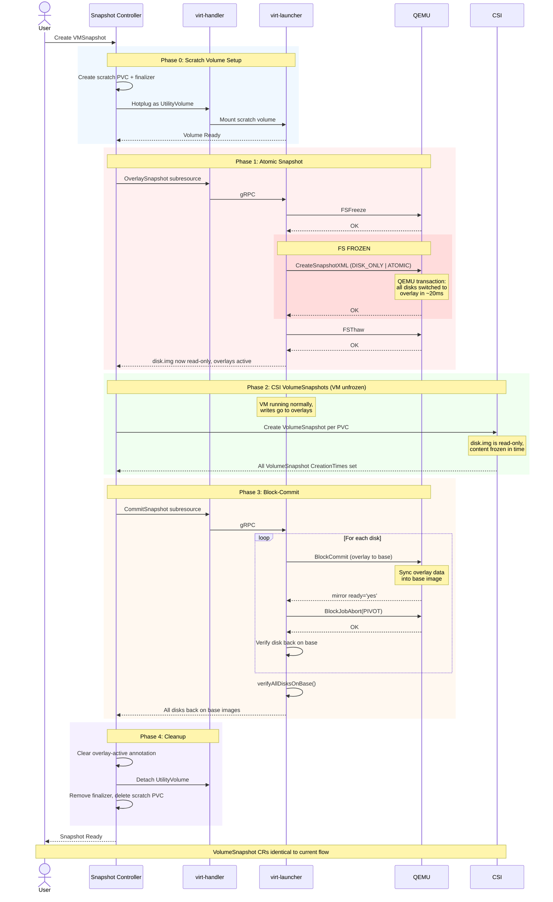

# VEP #NNNN: Online VMSnapshot Using Disk Overlays

## VEP Status Metadata

### Target releases

- This VEP targets alpha for version: v1.10
- This VEP targets beta for version:
- This VEP targets GA for version:

### Release Signoff Checklist

Items marked with (R) are required *prior to targeting to a milestone / release*.

- [ ] (R) Enhancement issue created, which links to VEP dir in [kubevirt/enhancements]
- [ ] (R) Alpha target version is explicitly mentioned and approved
- [ ] (R) Beta target version is explicitly mentioned and approved
- [ ] (R) GA target version is explicitly mentioned and approved


## Overview

The current online VMSnapshot flow keeps the VM frozen while CSI snapshots are
taken, making the freeze duration entirely dependent on CSI driver speed and
Kubernetes snapshot infrastructure throughput. This VEP introduces a new flow
that uses a QEMU external snapshot transaction to atomically establish the
snapshot point at the libvirt level in sub-millisecond time, unfreeze the guest
immediately, then take CSI VolumeSnapshots of the now-read-only base images
asynchronously while the VM runs normally. After CSI snapshots are complete,
block-commit the overlays back into the base images and clean up. The existing
VMSnapshot flow remains unchanged and serves as the default.

This makes the freeze duration independent of CSI driver speed, disk count, or
Kubernetes API throughput.


## Motivation

The online VMSnapshot flow freezes the guest filesystem and creates
CSI VolumeSnapshots for each of the VM's disks. The VM stays frozen until all
snapshots have their `CreationTime` set, meaning the freeze duration depends
entirely on how fast the CSI driver and the Kubernetes snapshot infrastructure
can process the requests. Even for a single disk, a slow CSI driver can exceed
acceptable freeze times. For VMs with multiple disks, tuning the
external-snapshotter's `--kube-api-qps`/`--kube-api-burst`/`--worker-threads` can
reduce the Kubernetes API throttling overhead, but even with optimal settings the
bottleneck moves to the CSI driver and storage layer, which KubeVirt has no control
over. This creates several problems:

### 1. Windows VSS hard timeout

Windows has a [non-configurable 10-second limit](https://learn.microsoft.com/en-us/windows/win32/vss/overview-of-processing-a-backup-under-vss)
on how long the filesystem can be held frozen during shadow copy creation. When
this limit is exceeded, the VSS provider returns
[`VSS_E_HOLD_WRITES_TIMEOUT` (0x80042314)](https://support.microsoft.com/en-us/topic/time-out-errors-occur-in-volume-shadow-copy-service-writers-and-shadow-copies-are-lost-during-backup-and-during-times-when-there-are-high-levels-of-input-output-69abf5d3-eadd-9a9a-416a-d1a5752dbef4),
VSS writers enter Failed state, and the snapshot is crash-consistent rather
than application-consistent. If the CSI
driver or Kubernetes snapshot infrastructure takes more than 10 seconds to
process the snapshots, the freeze window exceeds this limit.

### 2. Long freeze is dangerous on any OS

Even without the Windows 10-second limit, keeping a filesystem frozen for
extended periods is harmful on Linux as well:

- **`fsfreeze` is designed for brief use**: the Linux
  [`fsfreeze(8)`](https://www.man7.org/linux/man-pages/man8/fsfreeze.8.html)
  mechanism is intended for the short window needed to take a storage-level
  snapshot (typically <100ms for LVM/dm snapshots). Holding it for extended
  periods while waiting for CSI round-trips is far outside the intended use case.
- **Application disruption**: applications running inside the VM (databases,
  web servers, ERP systems) experience blocked I/O during the freeze. This
  can cause client disconnects, replication lag, and service interruptions,
  especially for latency-sensitive workloads commonly migrated to KubeVirt.

### The core design issue

**A snapshot operation should never keep the guest frozen while waiting for
external infrastructure (CSI drivers, Kubernetes controllers) to respond.**
The freeze should only last as long as the hypervisor-level snapshot point
needs to be established - which is sub-millisecond at the QEMU level.


## Goals

- Reduce the VM freeze window during snapshot to sub-second, regardless of
  CSI driver speed or disk count
- Make VMSnapshot work reliably for Windows VMs regardless of CSI driver
  latency or number of disks
- Preserve full backward compatibility: restore from snapshots taken with the
  new flow must work identically to today
- VolumeSnapshot CRs produced are identical to the current flow
- No changes to the restore path

## Non Goals

- Replacing CSI VolumeSnapshots with a different snapshot mechanism. We still
  use CSI VolumeSnapshots for the actual storage-level snapshot
- Offline VM snapshots. This VEP focuses on online (running) VM snapshots
- Incremental backup integration. CBT/incremental backup is a separate feature
  ([VEP #25](https://github.com/kubevirt/enhancements/blob/main/veps/sig-storage/incremental-backup.md))
  that coexists with this proposal
- Backup vendor integration. External backup providers (Velero, Kasten) that
  manage their own CSI snapshots currently use freeze/unfreeze hooks. Exposing
  the libvirt-level snapshot to these vendors via a dedicated CRD
  (e.g. `VirtualMachineSnapshotRequest`) could be addressed in a follow-up VEP


## Definition of Users

- **VM owners:** Users who create VMSnapshots of their running VMs, especially
  VMs where the CSI driver or disk count causes the freeze to exceed acceptable
  durations
- **Cluster administrators:** Operators who manage KubeVirt and need to
  understand the new snapshot flow for troubleshooting


## User Stories

As a Windows VM owner, I want to take a VMSnapshot without VSS writers failing
so that my backups are application-consistent and I can migrate from VMware
to KubeVirt

As a Linux VM owner running a database, I want the snapshot freeze window to
be as short as possible so that my database connections don't time out and my
application doesn't experience visible hangs during backup

As a VM owner who snapshots regularly, I want VMSnapshot to work reliably
regardless of how many disks the VM has or how fast the CSI driver is so that
I can take snapshots without worrying about freeze timeouts or guest application
disruption


## Repos

- [kubevirt/kubevirt](https://github.com/kubevirt/kubevirt)


## Design

### Current flow (what changes)

```
1. Freeze guest filesystem (QEMU guest agent)
2. Create N VolumeSnapshot CRs
3. Wait for all CreationTime to be set - VM stays frozen
4. Unfreeze guest filesystem
```

### New flow

```
Phase 0: Create scratch PVC, hotplug as UtilityVolume
Phase 1: Freeze -> QEMU transaction (all disks, atomic, ~20ms) -> Unfreeze
Phase 2: Create N VolumeSnapshot CRs (VM is unfrozen, no time pressure)
Phase 3: Block-commit overlays back to base images
Phase 4: Cleanup scratch volume
```

Freeze duration: **O(1)** - <500ms regardless of disk count.

### Phase 0: Scratch volume setup

Before taking the snapshot, the snapshot controller:

1. Creates a PVC (`snap-scratch-{uid}`) sized to hold qcow2 overlay files
   for all disks during the overlay window. By default, the size is calculated based
   on the VMSnapshot's existing `spec.failureDeadline` field (default: 5
   minutes) and an estimated maximum write rate
   (see [Scalability](#scalability)), or can be overridden via
   `spec.overlayScratchSize` on the VMSnapshot.
2. Hotplugs the PVC as a UtilityVolume to the VMI via JSON patch on
   `spec.utilityVolumes` (same mechanism as [VEP #90 Utility Volumes](https://github.com/kubevirt/enhancements/blob/main/veps/sig-storage/utility-volumes.md),
   same pattern as the incremental backup push-target PVC in [VEP #25](https://github.com/kubevirt/enhancements/blob/main/veps/sig-storage/incremental-backup.md)).
3. Adds a Kubernetes finalizer `snapshot.kubevirt.io/overlay-protection`
   to prevent accidental deletion.
4. Waits for the volume to reach `VolumeReady` or `HotplugVolumeMounted` status.

### Phase 1: QEMU atomic snapshot (overlay creation)

Once the scratch volume is mounted, the snapshot controller calls a new
`OverlaySnapshot` subresource on the VMI. Inside virt-launcher:

```go
dom.FSFreeze(nil, 0)
dom.CreateSnapshotXML(snapshotXML,
    DOMAIN_SNAPSHOT_CREATE_DISK_ONLY |
    DOMAIN_SNAPSHOT_CREATE_ATOMIC |
    DOMAIN_SNAPSHOT_CREATE_NO_METADATA)
dom.FSThaw(nil, 0)
```

This is a single [`virDomainSnapshotCreateXML`](https://libvirt.org/html/libvirt-libvirt-domain-snapshot.html#virDomainSnapshotCreateXML)
call that sends one QEMU `transaction` QMP command
containing a [`blockdev-snapshot`](https://qemu-project.gitlab.io/qemu/interop/live-block-operations.html)
action for every snapshotable disk. QEMU executes them all atomically in
sub-millisecond time. Non-snapshotable disks (cloud-init, ephemeral) are
marked with `snapshot='no'` in the XML.

After this call:
- The original disk images (disk.img / block devices) are **read-only** - the
  snapshot point
- New VM writes go to qcow2 overlay files on the scratch volume
- The VM is unfrozen and running normally

The `QUIESCE` flag is not used because KubeVirt's QEMU guest agent command
allowlist blocks direct `guest-fsfreeze-freeze` calls from libvirt. Instead,
we call `dom.FSFreeze()` ourselves (same pattern as backup.go).

### Phase 2: CSI VolumeSnapshots

The snapshot controller creates VolumeSnapshot CRs for each PVC - exactly
the same as today. The only difference is that the VM is **unfrozen** during
this phase. The CSI snapshots capture the read-only base images, which contain
the exact frozen-point-in-time data regardless of how long the CSI processing
takes.

**Safety mechanisms:** While the VM is unfrozen during this phase, the overlay
files on the scratch PVC continue to grow with every write. Two mechanisms
prevent the scratch PVC from filling up:

- **Overlay usage monitoring:** virt-launcher monitors scratch volume usage
  in the background (same pattern as the freeze auto-unfreeze safety timer).
  If usage crosses a threshold (e.g. 80%), it notifies the snapshot controller,
  which aborts Phase 2, deletes pending VolumeSnapshot CRs, triggers
  block-commit to restore the VM, and marks the VMSnapshot as Failed with a
  clear error indicating insufficient scratch space.

- **Timeout:** Phase 2 is bounded by the VMSnapshot's existing
  `FailureDeadline` (default: 5 minutes, configurable per-snapshot). If any
  VolumeSnapshot has not received its `CreationTime` within this deadline,
  the same abort flow is triggered.

The scratch PVC is sized to accommodate the maximum possible writes within
the `FailureDeadline` (see [Scalability](#scalability)).

### Phase 3: Block-commit

After all VolumeSnapshots have `CreationTime` set, the snapshot controller
calls a new `CommitSnapshot` subresource on the VMI. Inside virt-launcher,
for each disk:

1. **Check state**: Is the disk on overlay? If already on base, skip (idempotent).
   Is there an existing block job? Resume waiting instead of starting a new one.
2. **Start commit**: `dom.BlockCommit(disk, "", "", 0, ACTIVE | DELETE)` ([ref](https://libvirt.org/kbase/merging_disk_image_chains.html))
3. **Wait for READY**: Parse domain XML for `<mirror ready='yes'>` attribute,
   which reflects libvirt's internal state after receiving QEMU's
   [`BLOCK_JOB_READY`](https://libvir-list.redhat.narkive.com/KKDmcDw5/libvirt-rfc-exposing-ready-bool-of-query-block-jobs-or-qmp-block-job-ready-event) event.
4. **Pivot**: `dom.BlockJobAbort(disk, PIVOT)` with retry (10x, 200ms backoff).
5. **Verify**: Read domain XML and confirm the disk source is back on the
   original base image. If still on overlay, return error - do NOT proceed
   to cleanup.

After ALL disks are committed and verified:
- Final verification: `verifyAllDisksOnBase()` reads the full domain XML
  and checks every disk source

### Phase 4: Cleanup

Once all disks are back on their base images:
- Clear the `snapshot.kubevirt.io/overlay-active` annotation on the VMI
- Detach the utility volume via JSON patch
- Remove the finalizer from the scratch PVC
- Delete the scratch PVC

### Full flow diagram



### Overlay state tracking

An annotation `snapshot.kubevirt.io/overlay-active` is set on the VMI when
overlays are active (after Phase 1) and cleared after successful commit
(after Phase 3). This annotation is checked by:

- **Migration**: blocks `startMigration()` - migration with overlays would
  break the backing chain on the target node
- **Backup**: blocks `BackupVirtualMachine()` - backup checkpoints on an
  overlay become invalid after commit
- **Volume unplug**: blocks `removeVolumeRequestHandler()` - unplugging a
  disk with an active overlay would orphan the overlay
- **Disk resize**: skips resize in `syncDisks()` - resizing during overlay
  could cause size mismatch between overlay and base
- **VM destroy**: `KillVMI()` aborts active block jobs before
  `DestroyFlags()` - prevents orphaned block jobs
- **VM crash / pod eviction**: the overlay + base together remain consistent
  (no data loss). Once the VM comes back up, the pending commit resumes and
  completes the cleanup. The scratch PVC finalizer ensures it survives across
  restarts.

### Block-commit safety

The block-commit (Phase 3) is the most safety-critical part of the design.
The following mechanisms ensure it cannot leave the VM in a corrupted state:

1. **Correct pivot detection**: Parse domain XML for `<mirror ready='yes'>`.
   This reflects libvirt's actual internal state after receiving QEMU's
   `BLOCK_JOB_READY` event, eliminating the known race condition that causes
   premature pivot errors.
2. **Idempotent and resumable**: Each disk is checked individually. Already
   committed -> skip. Active block job from previous attempt -> resume waiting.
   Safe to call multiple times.
3. **Post-commit verification**: After each disk AND after all disks, read the
   live domain XML and verify the source path. If any disk is still on overlay,
   return error and do NOT clean up.
4. **Finalizer on scratch PVC**: `snapshot.kubevirt.io/overlay-protection`
   prevents Kubernetes from garbage-collecting the PVC. Only removed after
   verification passes.
5. **Never auto-delete on commit failure**: If commit fails, the scratch PVC
   is preserved and the controller requeues for retry. The CSI-level snapshot
   itself is valid (the data was captured), but the cleanup/commit phase is
   marked as incomplete. The VM keeps running on overlays safely until the
   commit succeeds.

### Fallback

If `OverlaySnapshot` fails for any reason (no guest agent, libvirt error,
unsupported configuration), the controller falls back to the current
sequential CSI path automatically, as the new flow is regarded as an
optimization, not a requirement.

### Restore (unchanged)

The VolumeSnapshot CRs produced by the new flow are identical to what the
current flow produces - they capture the same disk.img content at the same
frozen point-in-time. The restore controller creates PVCs from these
VolumeSnapshots the same way it does today. No changes to the restore path.

### Early validation

Initial testing on a 6-disk Fedora VM (kubevirtci, Ceph storage) showed the
following timings for the new flow:

| Phase | Time |
|-------|------|
| Freeze + QEMU transaction + Unfreeze | ~464ms (FS frozen for ~20ms) |
| CSI VolumeSnapshots (VM unfrozen) | ~9s |
| Block-commit + verification (6 disks) | ~126ms |
| Cleanup | ~30ms |

The FS is only frozen during the QEMU transaction itself (~20ms), not
during the flush or unfreeze. Well within the Windows VSS 10-second limit.

### Upstream RFE: write-blocking mode for active block-commit

To make the block-commit sync phase more robust under heavy guest I/O, QEMU's
mirror engine supports a `write-blocking` copy mode that ensures guest writes
are completed on both the overlay and the base simultaneously, guaranteeing
deterministic convergence. This mode is currently available for `blockdev-mirror`
but not yet exposed for `block-commit`. An RFE has been filed to add this
support: [RHEL-178640](https://issues.redhat.com/browse/RHEL-178640).

If exposed for block-commit, this mode could improve commit convergence
under sustained heavy write load.


## API Examples

### VMSnapshot with overlay scratch size override

```yaml
apiVersion: snapshot.kubevirt.io/v1beta1
kind: VirtualMachineSnapshot
metadata:
  name: my-snapshot
spec:
  source:
    apiGroup: kubevirt.io
    kind: VirtualMachine
    name: my-windows-vm
  overlayScratchSize: "8Gi"  # optional, overrides default calculation
```

### Overlay-active annotation on VMI during snapshot

```yaml
apiVersion: kubevirt.io/v1
kind: VirtualMachineInstance
metadata:
  name: my-windows-vm
  annotations:
    snapshot.kubevirt.io/overlay-active: "my-snapshot"
```

### Scratch PVC with finalizer

```yaml
apiVersion: v1
kind: PersistentVolumeClaim
metadata:
  name: snap-scratch-ae375815
  labels:
    snapshot.kubevirt.io/scratch: my-snapshot
  finalizers:
  - snapshot.kubevirt.io/overlay-protection
spec:
  accessModes: [ReadWriteOnce]
  resources:
    requests:
      storage: 6Gi
```


## Alternatives

### Push-mode backup to separate PVC

Instead of switching VM disks to overlays, use KubeVirt's existing push-mode
backup API (which uses `virDomainBackupBegin` under the hood) to copy
consistent point-in-time disk data to separate target PVCs. QEMU preserves
old blocks before overwriting them while a background job copies the data
out. The snapshot controller would then take CSI VolumeSnapshots of those
target PVCs and attach them to the VMSnapshot.

If the target PVCs are kept persistently and combined with CBT (Changed Block
Tracking), the first VMSnapshot of a VM performs a full copy of every disk to
the target PVCs, but any subsequent VMSnapshot of the same VM only copies the
blocks that changed since the last snapshot.

**Pros:**
- No overlays on the live disk chain, no block-commit, no live merge risk
- If target PVCs are kept persistently and combined with CBT, subsequent
  snapshots only push the delta (changed blocks), making them fast

**Cons:**
- Without persistent target PVCs, every snapshot requires a full data copy
  of every disk, which can be heavy I/O for large VMs and take minutes to
  hours
- With persistent target PVCs, the full copy only happens once, but requires
  2x permanent storage (a full-size target PVC per disk for the lifetime of
  the VM)
- Additional PVC management complexity (sizing, lifecycle, storage class)

**Assessment:** This approach avoids the complexity of live overlays and
block-commit entirely, which is a meaningful advantage. The tradeoff depends
on whether target PVCs are kept or not. Without persistent target PVCs, every
snapshot performs a full copy of every disk, which is not ideal for VMs with
multiple large disks where the I/O overhead can be significant. With persistent
target PVCs, the full copy only happens once and subsequent snapshots push
only the delta via CBT, but every VM needs a full-size target PVC per disk
for its entire lifetime, effectively doubling the storage requirement.

### Tuning external-snapshotter parameters

Increase `--kube-api-qps`, `--kube-api-burst`, and `--worker-threads` on
the external-snapshotter sidecar to reduce Kubernetes API throttling during
multi-disk snapshot creation.

**Pros:**
- No code changes in KubeVirt
- Can meaningfully reduce the freeze window for multi-disk VMs where API
  throttling is the bottleneck

**Cons:**
- Only addresses the Kubernetes API overhead, not the CSI driver latency.
  Once throttling is eliminated, the bottleneck moves to the storage layer
  which KubeVirt has no control over
- A single slow CSI driver can still exceed the VSS 10-second limit
  regardless of tuning
- Requires cluster-level configuration changes that may not be feasible
  in all environments
- Does not solve the fundamental problem: the VM stays frozen while
  waiting for external infrastructure

**Assessment:** Helpful as a mitigation for multi-disk scenarios, but does
not eliminate the dependency on CSI driver speed. The freeze duration remains
unpredictable and externally determined.


## Scalability

- **Scratch PVC sizing.** Users can set `spec.overlayScratchSize` on the
  VMSnapshot to control the scratch PVC size directly. If not set, the
  following default calculation is used:

  ```
  min(FailureDeadline × max_write_rate × 2, total_disk_size × 1.1)
  ```

  The calculation is based on two bounds:

  1. **Write-rate estimate** (`FailureDeadline × max_write_rate × 2`):
     the qcow2 overlay only stores blocks that the VM actually writes
     during the overlay window (new writes are redirected to the overlay,
     the base image is untouched), so disk capacity is not a factor,
     only the VM's write rate and the
     duration of the overlay window matter. `FailureDeadline` is the
     VMSnapshot's existing `spec.failureDeadline` (default: 5 minutes,
     configurable per-snapshot). `max_write_rate` is a conservative estimate
     of maximum sustained write throughput (e.g. 50MB/s). `× 2` is a safety
     margin to account for write bursts.

  2. **Disk capacity cap** (`total_disk_size × 1.1`): the overlay can never
     exceed the total virtual disk capacity, since writes are bounded by the
     guest's addressable space. The 10% margin accounts for qcow2 metadata
     (L1/L2 tables, refcount blocks). The actual metadata overhead is
     typically well under 1% for most disk sizes, but the margin provides
     a safe buffer
     ([qcow2 format spec](https://www.qemu.org/docs/master/interop/qcow2.html)).

  The `min()` of these two ensures the scratch PVC is sized for realistic
  usage while never exceeding the theoretical maximum.

  For example, a VM with 10 × 10Gi disks and default 5-minute deadline:
  `min(5min × 50MB/s × 2, 100Gi × 1.1) = min(30Gi, 110Gi) = 30Gi`.
  A small VM with 2 × 5Gi disks: `min(30Gi, 11Gi) = 11Gi` (capped by
  total disk size + metadata).

- The QEMU transaction is O(1) in wall-clock time regardless of disk count -
  sub-millisecond for any number of disks.
- Block-commit time scales linearly with overlay data size, not disk count.
  Overlay size depends on guest I/O activity during the CSI snapshot window:
  mostly idle VMs will have small overlays, while VMs under heavy write load
  will accumulate more data.
- The CSI VolumeSnapshot creation time is unchanged - still serialized by
  the external-snapshotter. But the VM is unfrozen during this phase, so
  the serialization is no longer a problem.


## Update/Rollback Compatibility

- The feature is additive - no existing API fields are removed or changed.
- New fields: `spec.overlayScratchSize` on VMSnapshot (optional).
- New subresources: `overlaysnapshot`, `commitsnapshot` on VMI.
- New annotation: `snapshot.kubevirt.io/overlay-active` on VMI (transient).
- Rollback: disable the feature gate. VMSnapshot reverts to the current
  sequential CSI path. No data migration needed.
- Snapshots taken with the new flow are restorable by any version - the
  VolumeSnapshot CRs are standard K8s objects with no KubeVirt-specific
  format changes.


## Functional Testing Approach

### Unit tests
- Mock VirDomain: verify `CreateSnapshotXML` is called with correct flags
  (`DISK_ONLY | ATOMIC | NO_METADATA`)
- Mock VirDomain: verify `BlockCommit` -> `waitForReady` (XML parsing) ->
  `BlockJobAbort(PIVOT)` sequence
- Verify `verifyAllDisksOnBase` catches disks still on overlay
- Verify `filterVMDisks` excludes cloud-init and scratch volume disks
- Verify `calculateOverlaySize` returns correct sizes

### Integration tests (kubevirtci)
- Take VMSnapshot with varying disk configurations (e.g. root disk only, root + 5 hotplug disks, root + 10 hotplug disks), verify for each:
  - Scratch PVC created with finalizer
  - Utility volume hotplugged
  - Overlay snapshot taken (all disks on overlays)
  - CSI VolumeSnapshots created
  - Block-commit completed (all disks back on base)
  - Scratch PVC cleaned up
  - VMSnapshot status: Succeeded
- Restore from the snapshot, verify VM boots and data is consistent
- Verify fallback to sequential path when guest agent is unavailable
- Verify migration is blocked during overlay window
- Verify backup is blocked during overlay window

### Windows-specific tests
- Windows VM with 10 disks: verify VSS writers remain Stable after snapshot
- Verify no `0x80042314` (VSS_E_HOLD_WRITES_TIMEOUT) errors in guest agent logs

### Edge case tests
- Kill virt-launcher pod during overlay window: verify scratch PVC preserved
- Kill virt-launcher pod during commit: verify recovery on restart
- Concurrent snapshot requests: verify only one proceeds (SnapshotInProgress lock)


## Implementation History

TBD


## Implementation Phases

- Overlay snapshot and block-commit subresources on VMI, including gRPC
  and virt-launcher implementation
- Scratch volume lifecycle in the snapshot controller (creation, hotplug,
  sizing, finalizer, cleanup)
- Snapshot controller integration with fallback to current flow
- Edge case guards and overlay state tracking (migration, backup, unplug,
  resize, destroy)
- Testing and hardening (unit, integration, Windows VSS, crash recovery)
- Upstream QEMU RFE for write-blocking mode on block-commit
  ([RHEL-178640](https://issues.redhat.com/browse/RHEL-178640))


## Graduation Requirements

### Alpha

- Feature gated behind `OverlayVMSnapshot`
- Core mechanism working: overlay snapshot + CSI + block-commit
- Utility volume lifecycle
- Edge case guards (migration, backup, unplug, resize)
- Basic unit and integration tests
- Documentation of the feature and its limitations

### Beta

- Crash recovery logic (detect orphaned overlays on restart)
- Windows VM testing with VSS validation
- Performance benchmarks across multiple CSI drivers
- Stress testing under heavy I/O workloads

### GA

- Production validation across multiple releases
- No regressions in existing snapshot/restore functionality
- Complete test coverage for all edge cases


